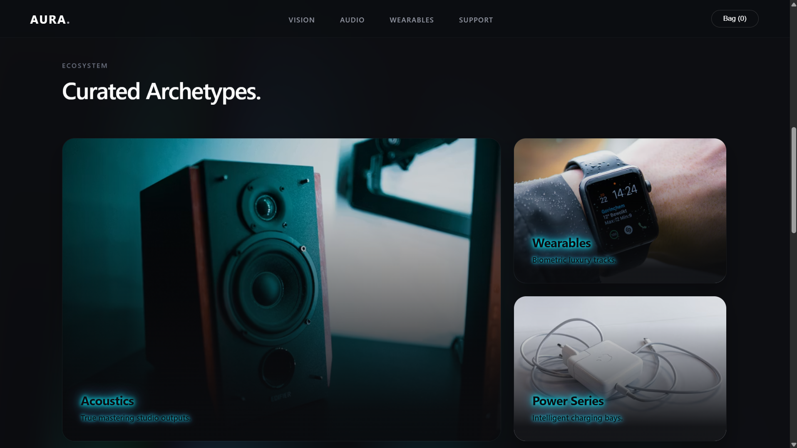

# AURA. — Modular High-Fidelity Front-End E-Commerce System

An architectural showcase of a modern, ultra-premium digital storefront interface. Built using **React 18** and **Vite**, `AURA.` implements high-end visual design systems—including procedural motion fields, complex CSS text-shadow geometry, and decoupled lifecycle-aware event triggers—without relying on heavy third-party graphic dependencies.

---

## 🛠️ Advanced System Architecture & Engineering

The interface is engineered around four core pillars of modern front-end engineering:

### 1. Zero-Dependency Graphical Pipelines
Instead of importing intensive animation libraries (e.g., Framer Motion or Three.js) which bloat production bundle sizes, `AURA.` uses pure CSS hardware-accelerated composite layers. By decoupling structural layouts from motion fields, rendering operations are offloaded directly to the GPU via the `will-change: transform` property.

### 2. Lifecycled Viewport Observers
The application orchestrates viewport entrance transitions through a unified **Intersection Observer API** loop inside `App.jsx`. Rather than attaching expensive event listeners to the window scroll handler (which causes layout thrashing and drops frame rates), the system natively queries the browser layout subsystem only when element thresholds change.

### 3. Isolated Scoped Shadow Cascades
To guarantee structural components remain self-contained and modular, visual layouts utilize scoped string literals within component boundaries. This prevents side-effects in global style cascades, allowing individual layout files to be dropped into any standard production workspace seamlessly.

---

## 📁 Technical Directory Structure

```text
ECOMMPROJECT/
├── src/
│   ├── components/
│   │   ├── Navbar.jsx        # Glassmorphic blurs and responsive top navigation header
│   │   ├── Hero.jsx          # Cinematic landing layout with an absolute motion field
│   │   ├── Categories.jsx    # Complex text-shadow rendering and asymmetric bento matrices
│   │   ├── ProductGrid.jsx   # State-isolated retail matrix with reactive click handlers
│   │   └── Footer.jsx        # Monolithic multi-column architectural rows
│   ├── App.jsx               # Intersection engine hook and lifecycle orchestration
│   └── main.jsx              # Global execution environment configurations & normalization
```

---

## 🎨 Visual Journey & Component Breakdown

### 1. The Interface Foundation & Motion Engine (`Hero.jsx`)
The landing viewport introduces a high-end procedural animation system designed to simulate organic, fluid wave motions. This is achieved by combining linear repeating gradient bands shifted across two asynchronous keyframe timelines running at unequal prime frequencies (`15s` and `20s`) to ensure the design loops without repetitive patterns.


### 2. High-Contrast Asymmetric Matrices (`Categories.jsx`)
The bento grid architecture breaks traditional layout symmetry to direct user attention dynamically. The challenge of text readability over varied photography layers is addressed mathematically via multiple overlapping font shadows.



### 3. Interactive Inventory Hub
Presents the central storefront matrix displaying premium hardware. Each distinct product layout card features custom pricing typography, clean layouts, and a dedicated, responsive `Buy` action pill button.


---

## ⚙️ Development Environment Setup

To initialize and audit this front-end module on a local dev environment, execute the following operational commands within your terminal environment:

### Clean Dependencies Installation
```bash
npm install
```
### Local Dev Server Initialization
```bash
npm run dev
```