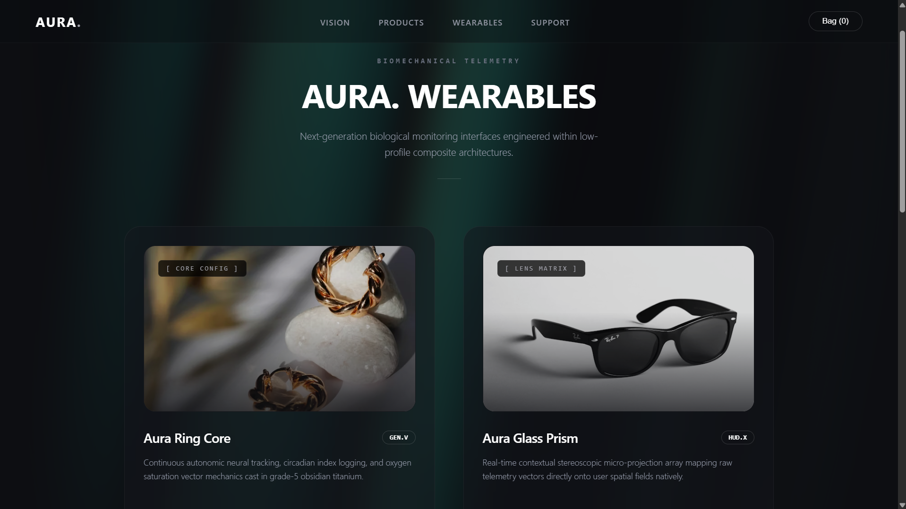
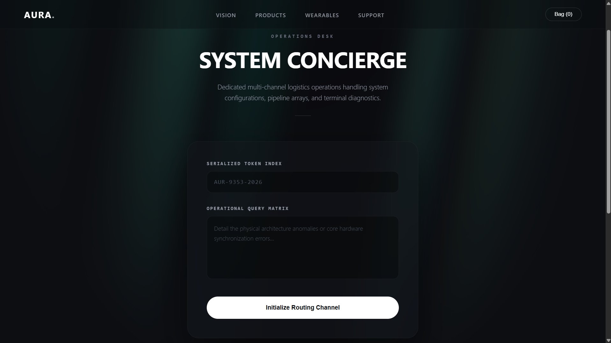

# AURA. — Modular High-Fidelity Front-End E-Commerce System

An architectural showcase of a modern, ultra-premium digital storefront interface. Built using **React 18**, **React Router v6**, and **Vite**, `AURA.` implements a fully decoupled client-side routing environment, high-end visual design systems—including synchronized fluid neon wave animation engines—and state-isolated interactive component views.

---

## 🛠️ Advanced System Architecture & Engineering

The interface is engineered around four core pillars of modern front-end engineering:

### 1. Client-Side Routing and Layout Isolation
Instead of relying on single-page section stacking or traditional browser hard-reloads, the system implements **Client-Side Routing** via `react-router-dom`. URL paths are parsed instantaneously to mount and unmount viewports (`/`, `/products`, `/wearables`, `/support`) natively without dropping state, resetting tracking properties, or forcing unnecessary network refetches.

### 2. Zero-Dependency Unified Motion Fields
To maximize performance and keep bundle sizes ultra-lean, `AURA.` avoids heavy third-party motion libraries. Instead, every distinct page route hosts a synchronized, hardware-accelerated **Aurora Neon Wave Engine** running on the GPU. Linear repeating gradient matrices are shifted continuously via CSS keyframes to serve as a consistent aesthetic backbone across different layouts.

### 3. Isolated Scoped Style Cascades
To guarantee structural components remain self-contained and modular, visual layouts utilize scoped style sheets and string literals enclosed directly within component boundaries. This prevents side effects in global style cascades, allowing files to be dropped into any standard production workspace seamlessly.

---

## 📁 Technical Directory Structure

```text
ECOMMPROJECT/
├── src/
│   ├── components/
│   │   ├── Navbar.jsx        # Fixed glassmorphic header leveraging declarative Router Links
│   │   ├── Hero.jsx          # Cinematic landing viewport with absolute motion fields
│   │   ├── Categories.jsx    # Fluid bento matrices with custom high-contrast headings
│   │   ├── ProductGrid.jsx   # State-isolated retail inventory over active neon fields
│   │   ├── Wearables.jsx     # Premium 2x2 asymmetric telemetry hardware product showcase
│   │   ├── Support.jsx       # Glassmorphic user dashboard desk service concierge hub
│   │   └── Footer.jsx        # Monolithic multi-column architectural rows
│   ├── App.jsx               # Central Route definition tree mapping isolated paths
│   └── main.jsx              # BrowserRouter mount point and global style normalization

```
## 🎨 Visual Journey & Component Breakdown

### 1. The Interface Foundation & Motion Engine (`Hero.jsx`)
The landing viewport introduces a high-end procedural animation system designed to simulate organic, fluid wave motions. This is achieved by combining linear repeating gradient bands shifted across two asynchronous keyframe timelines running at unequal prime frequencies to ensure the design loops without repetitive patterns.


### 2. High-Contrast Asymmetric Matrices (`Categories.jsx`)
The bento grid architecture breaks traditional layout symmetry to direct user attention dynamically. The challenge of text readability over varied photography layers is addressed mathematically via multiple overlapping font shadows.


### 3. Interactive Inventory Hub (`ProductGrid.jsx`)
Presents the central storefront matrix displaying premium hardware. Each distinct product layout card features custom pricing typography, clean layouts, and a dedicated, responsive `Buy` action pill button.


### 4. Biomechanical Wearables Suite (`/wearables`)
An advanced, highly vivid **2x2 structural grid** exhibiting premium monitoring gear. This view overrides default image compression layers to render product photography at high display luminance profiles (`opacity: 0.90`) while leveraging interactive border-glow transitions on selection.



### 5. Interactive System Concierge Terminal (`/support`)
A secure, centered glassmorphic communication block wrapped within blurred composite parameters (`backdrop-filter: blur(20px)`). Implements custom inputs with real-time text-focus outline borders and a stylized token tracker for simulated setup requests.



---

## ⚙️ Development Environment Setup

To initialize and audit this front-end module on a local dev environment, execute the following operational commands within your terminal environment:

### Clean Framework Dependencies Installation

```bash

npm install

```
### Routing Library Setup

```bash

npm install react-router-dom

```
 ### Local Dev Server Initialization

```bash

npm run dev

```